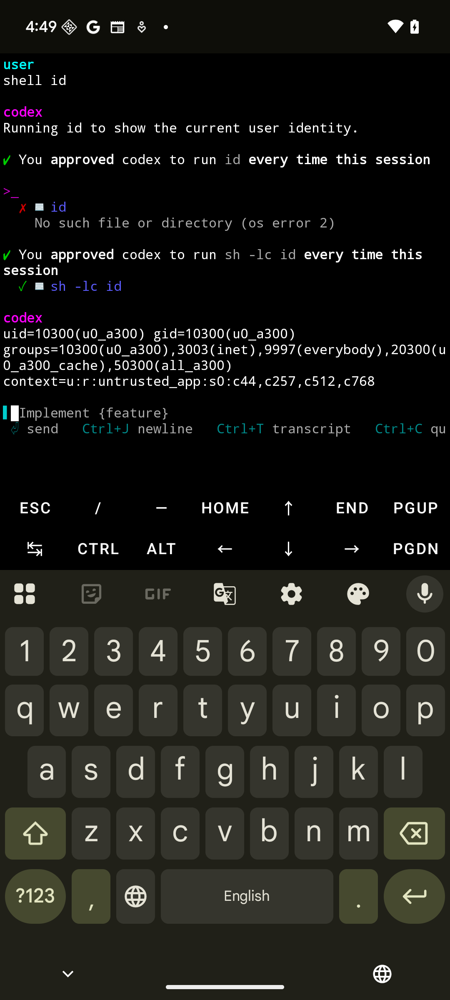

# Termux AI: Bootstrap-Free Terminal with Native Codex Integration

A modern fork of `termux/termux-app` that eliminates traditional package bootstrapping in favor of direct native executable integration. This implementation places Codex AI tools in Android's read-only `/data/app` directory for W^X (Write XOR Execute) compliance and enhanced security.

**Key Innovation**: No bootstrap installation required - native executables are automatically extracted by Android to read-only system locations and accessed via shell aliases.


*Termux AI running Codex CLI with interactive AI assistance*

Important: This fork supports only aarch64 (ARM64, `arm64-v8a`). Other ABIs are not supported.

## Implementation Overview
- **Bootstrap-free architecture**: Eliminates traditional Termux package installation
- **Native executable integration**: Uses Android's `extractNativeLibs=true` mechanism  
- **Read-only security**: Executables reside in `/data/app/.../lib/arm64/` (system-managed, non-writable)
- **Direct access**: Shell aliases provide seamless command execution
- **Android 14+ compatibility**: Full support for latest Android security requirements

## Technical Architecture

### Native Library Integration
- **Source**: Native ARM64 binaries from packages.termux.dev Debian packages
- **Extraction**: `.deb` packages extracted using `ar` and `tar` to obtain native binaries
- **Conversion**: Binaries renamed as `.so` files and placed in `app/src/main/jniLibs/arm64-v8a/`
  - AI tools: `libcodex.so`, `libcodex-exec.so` (custom Codex binaries)
  - Package management: `libapt.so` (from apt_2.8.1-2_aarch64.deb), `libdpkg.so`
  - Development runtime: `libnode.so` (from nodejs_24.7.0_aarch64.deb), `libnpm.so`, `libnpx.so`
  - Core utilities: `libcat.so`, `libecho.so`, `libls.so`, `libpwd.so` (from coreutils)
- **APK Integration**: Gradle packages `.so` files into APK with `extractNativeLibs=true`
- **Extraction**: Android automatically extracts to `/data/app/{package}/lib/arm64/` (read-only)
- **Access**: Shell aliases in `~/.profile` point directly to native library paths
- **Security**: W^X compliant - executables in read-only system-managed location

### Bootstrap Replacement
Traditional Termux bootstrap process has been completely replaced:
```java
// Before: Complex zip extraction and package installation
// After: Simple native executable verification and alias setup
private static void installNativeExecutables(Activity activity) throws Exception {
    String nativeLibDir = activity.getApplicationInfo().nativeLibraryDir;
    // Verify extracted libraries exist
    // Create .profile with aliases
}
```

### Android Compatibility
- **minSdk**: 34 (Android 14+)
- **targetSdk**: 35 (Android 14+)  
- **Architecture**: ARM64 (`arm64-v8a`) only
- **Distribution**: GitHub Releases (APK)

## Quick Start

1. **Install APK**: Download from [Releases](../../releases) and install on ARM64 Android device
2. **Launch app**: Opens directly with Codex available
3. **Use Codex**: 
   ```bash
   source ~/.profile    # Load aliases  
   codex --help         # AI CLI help
   codex-exec --help    # Non-interactive mode
   ```

## Building from Source

### Prerequisites
- Android SDK with API 35
- Java 17+
- ARM64 Android device or emulator
- ADB in PATH
- `wget` or `curl` for package downloads
- `ar` and `tar` for Debian package extraction

### Native Package Integration Flow

#### 1. Download Termux Packages
```bash
# Node.js runtime (24.7.0)
wget https://packages.termux.dev/apt/termux-main/pool/main/n/nodejs/nodejs_24.7.0_aarch64.deb

# APT package manager (2.8.1-2)  
wget https://packages.termux.dev/apt/termux-main/pool/main/a/apt/apt_2.8.1-2_aarch64.deb

# Additional packages as needed
wget https://packages.termux.dev/apt/termux-main/pool/main/d/dpkg/dpkg_1.22.6-1_aarch64.deb
```

#### 2. Extract Native Binaries
```bash
# Create extraction directory
mkdir -p native-binaries

# Extract .deb packages
for pkg in *.deb; do
    ar x "$pkg" data.tar.xz
    tar -xJf data.tar.xz -C native-binaries/
    rm data.tar.xz
done

# Locate ARM64 binaries
find native-binaries -name "node" -type f
# → native-binaries/data/data/com.termux/files/usr/bin/node

find native-binaries -name "apt" -type f  
# → native-binaries/data/data/com.termux/files/usr/bin/apt
```

#### 3. Convert to Android Native Libraries
```bash
# Copy binaries and rename as .so files for Android integration
mkdir -p app/src/main/jniLibs/arm64-v8a/

# Node.js ecosystem
cp native-binaries/data/data/com.termux/files/usr/bin/node app/src/main/jniLibs/arm64-v8a/libnode.so
cp native-binaries/data/data/com.termux/files/usr/bin/npm app/src/main/jniLibs/arm64-v8a/libnpm.so  
cp native-binaries/data/data/com.termux/files/usr/bin/npx app/src/main/jniLibs/arm64-v8a/libnpx.so

# Package management
cp native-binaries/data/data/com.termux/files/usr/bin/apt app/src/main/jniLibs/arm64-v8a/libapt.so
cp native-binaries/data/data/com.termux/files/usr/bin/dpkg app/src/main/jniLibs/arm64-v8a/libdpkg.so

# Verify executable permissions
chmod +x app/src/main/jniLibs/arm64-v8a/*.so
```

#### 4. Dependency Resolution
```bash
# Check runtime dependencies
readelf -d app/src/main/jniLibs/arm64-v8a/libnode.so | grep NEEDED
# Extract required shared libraries from packages and include as additional .so files

# Common Termux dependencies:
# - libc++_shared.so (from ndk-sysroot)
# - libandroid-support.so (from android-support package)
```

### Build & Install
```bash
make doctor          # Verify environment
make build           # Build debug APK  
make install         # Install via ADB
make run             # Launch app
```

## Implementation Details

### Key Files Modified
- **`TermuxInstaller.java`**: Replaced bootstrap with native executable verification
- **`TermuxShellEnvironment.java`**: Simplified PATH to `/system/bin` only
- **`AndroidManifest.xml`**: Added Android 14+ foreground service permissions
- **`TermuxActivity.java`**: Fixed broadcast receiver export flags

### Native Executable Flow
1. **Package Download**: Download ARM64 `.deb` packages from packages.termux.dev
2. **Binary Extraction**: Extract native binaries from Debian packages using `ar` and `tar`
3. **Library Conversion**: Copy binaries to `app/src/main/jniLibs/arm64-v8a/` as `.so` files
4. **Dependency Resolution**: Include required shared libraries for runtime dependencies
5. **Build Integration**: Gradle packages `.so` files into APK with `extractNativeLibs=true`
6. **Install time**: Android extracts libraries to `/data/app/{hash}/lib/arm64/` (read-only)
7. **First run**: App creates `~/.profile` with aliases pointing to extracted libraries
8. **Runtime**: Users execute commands via aliases that resolve to native library paths

### Android 14+ Compatibility  
Fixed multiple compatibility issues for modern Android:
```xml
<!-- AndroidManifest.xml -->
<uses-permission android:name="android.permission.FOREGROUND_SERVICE_SPECIAL_USE" />
<service android:name=".app.TermuxService" 
         android:foregroundServiceType="specialUse">
    <property android:name="android.app.PROPERTY_SPECIAL_USE_FGS_SUBTYPE" 
              android:value="terminal" />
</service>
```

```java
// TermuxActivity.java  
registerReceiver(receiver, filter, Context.RECEIVER_NOT_EXPORTED);
```

## Available Commands

After app launch, the following commands are available via aliases:

### AI Tools
- **`codex`**: AI CLI for interactive AI assistance
- **`codex-exec`**: Non-interactive AI command execution  

### Native Package Tools (APT Integration)
- **`apt`**: Package manager for installing additional ARM64 packages
- **`pkg`**: Simplified package management wrapper
- **`dpkg`**: Debian package management utilities

### Development Runtime
- **`node`**: Node.js runtime for JavaScript development
- **`npm`**: Node Package Manager for installing JavaScript packages
- **`npx`**: Node Package Execute for running packages without installing

### Core Utilities
- **`cat`**, **`echo`**, **`ls`**, **`pwd`**: Essential shell commands via native libraries

Example usage:
```bash
# Load aliases (auto-loaded in new shells)
source ~/.profile

# AI assistance
codex --help
codex "explain this command: ls -la"
codex-exec "write a shell script to backup files"

# Package management
apt update && apt upgrade
pkg install python
dpkg -l | grep python

# Node.js development
node --version
npm --version
npx --version
npm init -y
npm install express
npx create-react-app myapp

# Core utilities  
ls -la
cat file.txt
echo "Hello World"
```

## Alias Configuration

The app automatically creates `~/.profile` with direct aliases:
```bash
# Termux shell profile
export HOME=/data/data/com.termux/files/home
export PREFIX=/data/data/com.termux/files/usr

# AI Tools - Aliases for native executables in read-only /data/app location
alias codex='/data/app/{hash}/lib/arm64/libcodex.so'
alias codex-exec='/data/app/{hash}/lib/arm64/libcodex-exec.so'

# Package Management - Native APT integration
alias apt='/data/app/{hash}/lib/arm64/libapt.so'
alias pkg='/data/app/{hash}/lib/arm64/libpkg.so' 
alias dpkg='/data/app/{hash}/lib/arm64/libdpkg.so'

# Development Runtime - Node.js and NPM
alias node='/data/app/{hash}/lib/arm64/libnode.so'
alias npm='/data/app/{hash}/lib/arm64/libnpm.so'
alias npx='/data/app/{hash}/lib/arm64/libnpx.so'

# Core Utilities - Essential commands via native libraries
alias cat='/data/app/{hash}/lib/arm64/libcat.so'
alias echo='/data/app/{hash}/lib/arm64/libecho.so'
alias ls='/data/app/{hash}/lib/arm64/libls.so'
alias pwd='/data/app/{hash}/lib/arm64/libpwd.so'
```

### Native Library Symlinks
Core utilities and development tools are also available via traditional symlinks in the bootstrap directory:
```bash
# Bootstrap symlinks (for compatibility)
$PREFIX/bin/cat -> /data/app/{hash}/lib/arm64/libcat.so
$PREFIX/bin/echo -> /data/app/{hash}/lib/arm64/libecho.so  
$PREFIX/bin/ls -> /data/app/{hash}/lib/arm64/libls.so
$PREFIX/bin/pwd -> /data/app/{hash}/lib/arm64/libpwd.so
$PREFIX/bin/node -> /data/app/{hash}/lib/arm64/libnode.so
$PREFIX/bin/npm -> /data/app/{hash}/lib/arm64/libnpm.so
$PREFIX/bin/npx -> /data/app/{hash}/lib/arm64/libnpx.so
```

## Security & Compliance

### W^X (Write XOR Execute) Policy
- **Problem**: Android 10+ prevents execution of files in writable app directories
- **Solution**: Native libraries in read-only `/data/app` system location
- **Benefit**: Enhanced security - executables cannot be modified after installation

### SELinux Compatibility
- Uses Android's native library extraction mechanism
- Inherits proper SELinux contexts automatically
- No custom security policy modifications required

### Permissions
```xml
<!-- Required for Android 14+ foreground services -->
<uses-permission android:name="android.permission.FOREGROUND_SERVICE_SPECIAL_USE" />

<!-- Standard Termux permissions -->
<uses-permission android:name="android.permission.INTERNET" />
<uses-permission android:name="android.permission.WRITE_EXTERNAL_STORAGE" />
<uses-permission android:name="android.permission.WAKE_LOCK" />
```

## Differences from Standard Termux

### Hybrid Package Management
- **Traditional Termux**: Uses `pkg install` with full APT bootstrap installation
- **Termux AI**: Native library integration + selective APT functionality
  - Core tools (codex, cat, ls, etc.) as native libraries
  - APT/pkg available for additional packages when needed
  - Best of both worlds: instant availability + extensibility

### Optimized Environment  
- **PATH**: `/system/bin` + native library aliases
- **Core Executables**: Direct access via read-only native library locations
- **Additional Packages**: Available through integrated APT when needed
- **Dependencies**: Self-contained for core functionality, extensible for advanced use

### Enhanced Security
- **Execution**: Read-only native libraries prevent runtime modification
- **Permissions**: Minimal permission set for AI functionality
- **Isolation**: Native executables run with app permissions and SELinux context

## Development Workflow

### Complete Build Process
```bash
# 1. Environment setup
make doctor           # Check tools (adb, gradlew)
make devices          # List connected devices  
make verify-abi       # Ensure device is ARM64

# 2. Native package integration (first time setup)
./scripts/download-packages.sh   # Download .deb packages from packages.termux.dev
./scripts/extract-natives.sh     # Extract binaries and convert to .so files
./scripts/resolve-deps.sh         # Include runtime dependencies

# 3. Build and test
make build            # Build debug APK with native libraries
make lint test        # Code quality checks
make install          # Install on device
make run             # Launch app
make logs            # Monitor logs

# 4. Maintenance  
make clean           # Clean build outputs
make uninstall       # Remove from device
```

### Automated Native Integration Scripts

#### Package Download Script (`scripts/download-packages.sh`)
```bash
#!/bin/bash
set -e

PACKAGES_DIR="packages"
mkdir -p "$PACKAGES_DIR"
cd "$PACKAGES_DIR"

# Core packages with versions
wget -N https://packages.termux.dev/apt/termux-main/pool/main/n/nodejs/nodejs_24.7.0_aarch64.deb
wget -N https://packages.termux.dev/apt/termux-main/pool/main/a/apt/apt_2.8.1-2_aarch64.deb
wget -N https://packages.termux.dev/apt/termux-main/pool/main/d/dpkg/dpkg_1.22.6-1_aarch64.deb

echo "Package download complete"
```

#### Binary Extraction Script (`scripts/extract-natives.sh`)
```bash
#!/bin/bash
set -e

PACKAGES_DIR="packages"
NATIVES_DIR="native-binaries"
JNI_DIR="app/src/main/jniLibs/arm64-v8a"

# Clean and setup directories
rm -rf "$NATIVES_DIR" "$JNI_DIR"
mkdir -p "$NATIVES_DIR" "$JNI_DIR"

# Extract all .deb packages
for pkg in "$PACKAGES_DIR"/*.deb; do
    echo "Extracting $(basename "$pkg")..."
    ar x "$pkg" data.tar.xz
    tar -xJf data.tar.xz -C "$NATIVES_DIR/"
    rm data.tar.xz
done

# Convert binaries to .so files
TERMUX_PREFIX="$NATIVES_DIR/data/data/com.termux/files/usr/bin"

# Node.js ecosystem
cp "$TERMUX_PREFIX/node" "$JNI_DIR/libnode.so"
cp "$TERMUX_PREFIX/npm" "$JNI_DIR/libnpm.so"
cp "$TERMUX_PREFIX/npx" "$JNI_DIR/libnpx.so"

# Package management
cp "$TERMUX_PREFIX/apt" "$JNI_DIR/libapt.so"
cp "$TERMUX_PREFIX/dpkg" "$JNI_DIR/libdpkg.so"

# Set executable permissions
chmod +x "$JNI_DIR"/*.so

echo "Native library conversion complete"
```

### Release Process
```bash
# Full release build with native integration
./scripts/download-packages.sh   # Ensure latest packages
./scripts/extract-natives.sh     # Refresh native libraries
BUILD_TYPE=release make build     # Build release APK
make lint test                   # Final validation
```

## Testing & Verification

### Manual Testing (ARM64 only)
```bash
# Install and launch
make install run

# Connect to app and test functionality
adb shell run-as com.termux
cd /data/data/com.termux/files/home
source .profile
codex --help         # Should show AI CLI help
codex-exec --help    # Should show non-interactive help
node --version       # Should show Node.js version
npm --version        # Should show NPM version
npx --version        # Should show NPX version
```

### Build Verification
```bash
make lint test       # Code quality and unit tests
make verify-abi      # Ensure ARM64 device
make logs           # Monitor app behavior
```

## Known Limitations
- **ARM64 only**: Other architectures not supported  
- **Android 14+ required**: Minimum API level 34
- **Selective packaging**: Only essential packages included as native libraries
- **Bootstrap-free**: Traditional Termux bootstrap replaced with direct integration

## Project Status
✅ **Completed**:
- Bootstrap removal and native executable integration
- Android 14+ compatibility (foreground services, receivers)  
- Read-only `/data/app` placement with W^X compliance
- Shell alias configuration for seamless access
- Makefile build system with ARM64 verification
- Hybrid package management (native libraries + selective APT)

🎯 **Current Implementation**:
- Native Codex CLI available immediately after app launch
- Integrated APT/pkg package management for extensibility
- Node.js runtime and NPM for JavaScript development
- Core utilities (cat, ls, echo, pwd) as native libraries
- No internet required for core AI functionality  
- Secure read-only executable placement
- Compatible with latest Android security policies

### Package Integration Details
- **Source packages**: ARM64 Debian packages from packages.termux.dev repository
- **Core tools**: Embedded as native libraries for instant access (Node.js 24.7.0, APT 2.8.1-2)
- **APT integration**: Package manager available for additional software installation
- **Node.js runtime**: Full JavaScript development environment included with npm/npx
- **Automated workflow**: Scripts handle download, extraction, and .so conversion
- **Hybrid approach**: Performance + flexibility without traditional bootstrap overhead

## License
Follows upstream Termux licensing. See individual component licenses for native binaries.