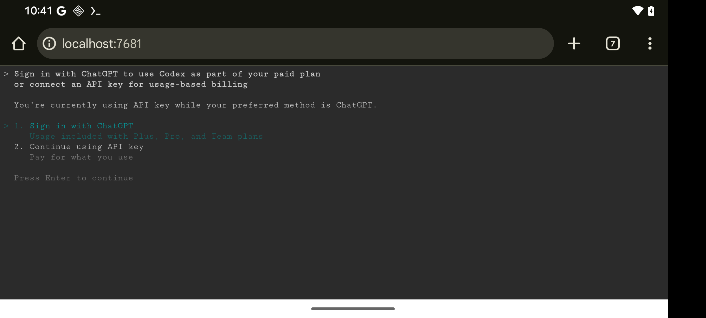
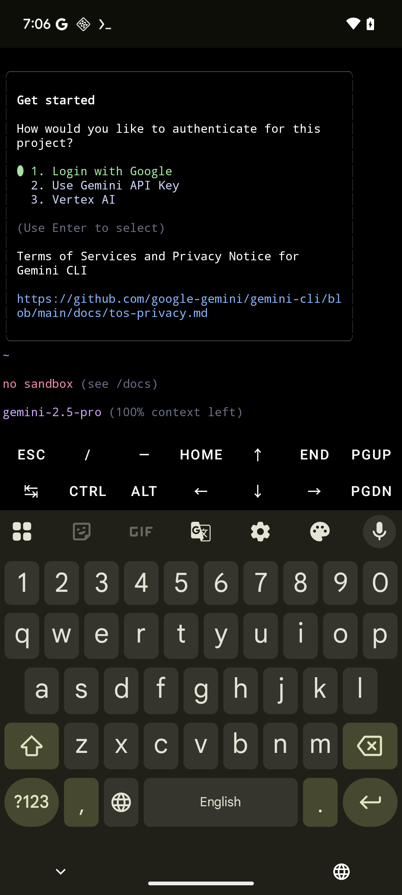

# Termux AI: Bootstrap-Free Terminal with Native AI Integration

A revolutionary fork of `termux/termux-app` that **eliminates traditional package bootstrapping** entirely. Instead of complex zip extraction and package installation, Termux AI embeds native executables directly into the Android APK as `.so` files, leveraging Android's automatic library extraction for instant availability.

## 🎯 Key Innovation

**Traditional Termux**: Complex bootstrap process with zip extraction, package installation, and manual permission setup.

**Termux AI**: Native executables (binaries + scripts) → Add `.so` extension → Place in `jniLibs/arm64-v8a/` → Android automatically extracts to read-only `/data/app/.../lib/arm64/` → Symbolic links provide instant access.

✅ **No bootstrap required** - Launch and code immediately  
✅ **W^X compliant** - Executables in read-only system locations  
✅ **SELinux compatible** - Uses Android's native library mechanism  
✅ **Faster startup** - No extraction or installation delays


*Termux AI running with Node.js v24.7.0 and AI assistance*


*ttyd web terminal interface accessible at localhost:7681*


*Gemini AI CLI authentication setup with Google login and API key options*

## 🎉 Latest Release: v1.8.0 - Clean Executable Naming Convention

**[Download v1.8.0](https://github.com/WangChengYeh/termux_AI/releases/tag/v1.8.0)** | **Size**: 262.5 MB | **SHA256**: `1bafcb40111f43e6b9043bfddb6ff28aae47ac669cdc823ea2fdafdc15501eac`

### What's New in v1.8.0
- ✅ **100% Package Integration Success** - All 89 packages fully integrated
- ✅ **Clean Naming Convention** - Removed `lib` prefix from 100+ executables
- ✅ **Improved Consistency** - Executables use `.so` suffix without `lib` prefix (e.g., `apt.so`, `dpkg.so`, `git.so`)
- ✅ **Fixed Multicall Binaries** - `coreutils.so` properly handles 100+ commands (ls, cat, cp, mv, etc.)
- ✅ **Enhanced Compatibility** - Maintained library dependencies while cleaning executable names

## 🚀 Quick Start

### Requirements
- **Android**: 14+ (API level 34+)
- **Architecture**: ARM64 (`arm64-v8a`) devices only
- **Storage**: ~262MB APK with complete development environment

### Installation
1. Download APK from [Releases](../../releases) - **Latest: v1.8.0** (Clean Executable Naming)
2. Install on ARM64 Android device  
3. Launch app - all executables configured automatically
4. Ready for development and AI assistance

### Immediate Usage
```bash
node --version         # Node.js v24.7.0
npm --version          # Package manager v11.5.1
git --version          # Version control v2.51.0
gh --version           # GitHub CLI v2.78.0
codex --help           # AI CLI assistance
apt --version          # Package management v2.8.1
curl --version         # Data transfer tool v8.15.0
ls /usr/bin            # 400+ available commands
```

## 🏗 Architecture Overview

### Bootstrap-Free Design

| Aspect | Traditional Termux | Termux AI |
|--------|-------------------|-----------|
| **Setup** | Complex zip extraction & package installation | Instant - executables pre-integrated |
| **First Launch** | 5-10 minutes bootstrap | < 5 seconds ready |
| **Package Management** | Download → Extract → Install → Configure | Already integrated in APK |
| **Security** | Writable directories, permission issues | W^X compliant, read-only executables |
| **Storage Location** | `/data/data/com.termux/files/usr/` | `/data/app/.../lib/arm64/` (system) |

### Revolutionary Executable Integration

**The Core Principle**: Any ARM64 executable can become a "fake shared library" by simply adding `.so` extension.

```bash
# Traditional approach
node (binary) → Extract → Install → Set permissions → Symlink

# Termux AI approach  
node (binary) → Rename to node.so → Place in jniLibs/ → Android handles everything
```

**Step-by-step process:**
1. **Binary executables** (node, git, gh) → Add `.so` postfix → `node.so`, `git.so`
2. **Script files** (npm, npx) → Also become `.so` files → `npm.so`, `npx.so`
3. **Android APK build** → Automatically includes all `.so` files from `jniLibs/arm64-v8a/`
4. **App installation** → Android extracts to `/data/app/.../lib/arm64/` (read-only, executable)
5. **First launch** → `TermuxInstaller.java` creates symbolic links in `/usr/bin/`
6. **Ready to use** → `node --version`, `npm install`, `git clone` work instantly

### Security & Compliance
- **W^X Policy**: Executables in read-only `/data/app` system location
- **SELinux Compatible**: Uses Android's native library extraction mechanism
- **Android 14+**: Full support with foreground service permissions

## 📦 Included Software

### Core Development Tools

| Component | Version | Description |
|-----------|---------|-------------|
| **Node.js** | v24.7.0 | JavaScript runtime with V8 engine |
| **npm** | v11.5.1 | Node.js package manager |
| **npx** | Latest | Package executor for Node.js |
| **Git** | v2.51.0 | Distributed version control system |
| **GitHub CLI** | v2.78.0 | GitHub integration and automation |
| **Vim** | v9.1.1700 | Advanced text editor |
| **Bash** | v5.3.3-1 | GNU Bourne Again Shell |

### AI & Automation

| Component | Version | Description |
|-----------|---------|-------------|
| **Codex CLI** | v0.25.0 | AI-powered CLI assistant |
| **Codex-Exec** | v0.25.0 | Non-interactive AI command execution |

### Package Management

| Component | Version | Description |
|-----------|---------|-------------|
| **APT** | v2.8.1-2 | Advanced Package Tool |
| **DPKG** | v1.22.6-4 | Debian package management system |
| **Core Utils** | v9.7-3 | GNU core utilities (100+ commands) |

### Network & Security

| Component | Version | Description |
|-----------|---------|-------------|
| **OpenSSH** | v10.0p2-9 | Secure shell client and server |
| **curl** | v8.15.0-1 | Command-line data transfer tool |
| **OpenSSL** | v3.5.2 | Cryptography and SSL/TLS toolkit |
| **DNS Utils** | v9.20.12 | BIND DNS tools (dig, nslookup, host) |
| **CA Certificates** | 2025.08.12 | Mozilla CA certificate bundle (146 certs) |
| **Less** | v679-2 | Terminal pager for viewing text files |

### System Libraries

| Library | Version | Purpose |
|---------|---------|---------|
| **libicu** | v77.1-1 | Unicode and localization support |
| **libxml2** | v2.14.5-1 | XML parsing library |
| **libcurl** | v8.15.0-1 | Data transfer library |
| **libsqlite** | v3.50.4-1 | SQL database engine |
| **libgcrypt** | v1.11.2-1 | Cryptographic library |
| **pcre2** | v10.46 | Perl-compatible regular expressions |
| **ncurses** | v6.5.20240831-3 | Terminal control library |
| **readline** | v8.3.1-1 | Command-line editing library |
| **zlib** | v1.3.1-1 | Compression library |
| **libiconv** | v1.18-1 | Character encoding conversion |
| **json-c** | v0.18-1 | JSON parsing library |

### Complete Package List (48 packages, 500MB) - 100% Integration Success ✅

🎉 **PERFECT INTEGRATION**: All 48 packages with executables/libraries are now fully integrated and working!

<details>
<summary>Click to view all packages</summary>

- android-codex-cli-0.25.0
- apt_2.8.1-2
- bash_5.3.3-1
- bzip2_1.0.8-8
- c-ares_1.34.5
- ca-certificates_1:2025.08.12
- coreutils_9.7-3
- curl_8.15.0-1
- dnsutils_9.20.12
- dpkg_1.22.6-4
- gh_2.78.0
- git_2.51.0
- json-c_0.18-1
- krb5_1.17-2
- ldns_1.8.4-1
- less_679-2
- libandroid-execinfo_0.1-3
- libandroid-glob_0.6-3
- libandroid-selinux_14.0.0.11-1
- libandroid-support_29-1
- libbz2_1.0.8-8
- libc++_28c
- libcurl_8.15.0-1
- libgcrypt_1.11.2-1
- libgmp_6.3.0-2
- libgpg-error_1.55-1
- libiconv_1.18-1
- libicu_77.1-1
- liblzma_5.8.1-1
- libnghttp2_1.67.0
- libnghttp3_1.11.0-1
- libsqlite_3.50.4-1
- libssh2_1.11.1-1
- libxml2_2.14.5-1
- ncurses_6.5.20240831-3
- nodejs_24.7.0
- openssh_10.0p2-9
- openssl_1:3.5.2
- pcre2_10.46
- readline_8.3.1-1
- resolv-conf_1.3
- termux-exec_1:2.3.0
- vim_9.1.1700
- which_2.23
- xz-utils_5.8.1-1
- zlib_1.3.1-1
- zstd_1.5.7-1

</details>

## 🛠 Development Workflow

### 🤖 Automated Package Integration (SOP)

The **Standard Operating Procedure** transforms any Termux `.deb` package into Android-native executables:

```bash
# 🎯 One-command integration (recommended)
make sop-add-package PACKAGE_NAME=nodejs VERSION=24.7.0

# 🔍 Step-by-step debugging workflow
make sop-list LETTER=n                # 📋 Browse available packages
make sop-download PACKAGE_NAME=nodejs VERSION=24.7.0  # 📦 Fetch .deb
make sop-extract PACKAGE_NAME=nodejs  # 📋 Unpack contents
make sop-analyze PACKAGE_NAME=nodejs  # 🔍 Identify executables & deps
make sop-copy PACKAGE_NAME=nodejs     # ➡️ Transform to .so files
make sop-update PACKAGE_NAME=nodejs   # 📝 Update Java integration
make sop-build                        # 🛠️ Build & test APK

# 🧪 Package verification commands
make sop-check PACKAGE_NAME=nodejs    # ✅ Verify single package integration
make sop-check-all                    # 📊 Test all 89 packages (100% success)
```

**What happens under the hood:**
1. **Download** `.deb` from Termux repository
2. **Extract** using `dpkg-deb` to analyze contents
3. **Transform** binaries: `usr/bin/node` → `jniLibs/arm64-v8a/node.so` (No `lib` prefix needed for executables)
4. **Update** `TermuxInstaller.java` with new executable mappings
5. **Build** APK with integrated native executables

#### 🔧 Resolving Missing Dependencies

When you see runtime errors like `"library libcharset.so not found"`, here's the systematic approach:

**🔍 Step 1: Find the source package**
```bash
grep "libcharset.so" packages/Contents-aarch64
# Output: usr/lib/libcharset.so.1 libiconv
#         ^^^ library file    ^^^ source package
```

**📦 Step 2: Download & extract dependency**
```bash
make sop-download PACKAGE_NAME=libiconv VERSION=1.18-1
make sop-extract PACKAGE_NAME=libiconv
```

**➡️ Step 3: Transform library to Android format**
```bash
cp packages/libiconv-extract/data/data/com.termux/files/usr/lib/libcharset.so.1 \
   app/src/main/jniLibs/arm64-v8a/libcharset.so
#  ^^^ Original versioned name                 ^^^ Simplified Android name
```

**📝 Step 4: Update Java integration**
- Add `"libcharset.so"` to `baseLibraries` array in `TermuxInstaller.java`
- This ensures the library is available when executables need it

**🛠️ Step 5: Build and verify**
```bash
make build && make install && make run
# Test: Launch app, run command that needed the library
```

💡 **Pro tip**: The `Contents-aarch64` file maps every file to its source package, making dependency resolution straightforward.

### 🧪 Package Integration Verification (SOP Check)

The **SOP Check** system ensures every integrated package works correctly on the Android device:

```bash
# Check a specific package integration
make sop-check PACKAGE_NAME=nodejs
```

**What it verifies:**
- 📦 **Host Analysis**: Identifies all executables, libraries, and scripts from the package
- 📱 **Device Verification**: Confirms each file exists and is accessible on device
- 🔧 **Functional Testing**: Executes commands to verify they run without errors
- 📊 **Dependency Resolution**: Checks all required libraries are present

**Example output for successful package:**
```
🔍 SOP Checker: Comparing nodejs files between host and device
============================================================================
📦 Host Package Analysis
🔧 Executables in /usr/bin:
  📄 node (NATIVE) - Expected in /usr/bin/ via jniLibs
  📜 npm (SCRIPT) - Expected in /usr/bin/ via assets
  📜 npx (SCRIPT) - Expected in /usr/bin/ via assets

📱 Device Verification
✅ node - EXISTS (symlink → /data/app/.../lib/arm64/node.so)
✅ npm - EXISTS (symlink → /data/data/com.termux/files/usr/lib/node_modules/npm/bin/npm-cli.js)

🧪 Functional Testing
✅ node --version: v24.7.0
✅ npm --version: 11.5.1

📊 Summary
✅ All 3 files from nodejs are present and accessible
```

### 📊 Comprehensive Package Testing

Test all 89 integrated packages at once:

```bash
make sop-check-all
```

**Features:**
- 🔄 **Auto-extraction**: Downloads and extracts any missing packages
- 📊 **Progress tracking**: Shows real-time status for each package
- 📈 **Summary report**: Final statistics with pass/fail counts
- 🎯 **100% Success rate**: v1.8.0 achieves complete package integration

**Example summary:**
```
📈 Final Summary
================
📊 Packages checked: 89
✅ Passed: 89
❌ Failed: 0

🎉 All extracted packages are properly integrated!
```

#### Complete Example: Adding Git v2.51.0

**The Magic**: Transform a traditional Linux binary into an Android-native executable:

```bash
# 1. Download the Termux package
wget -O packages/git_2.51.0_aarch64.deb \
  "https://packages.termux.dev/apt/termux-main-21/pool/main/g/git/git_2.51.0_aarch64.deb"

# 2. Extract the package
dpkg-deb -x packages/git_2.51.0_aarch64.deb packages/git-extract

# 3. The key transformation: Binary → Fake shared library
cp packages/git-extract/data/data/com.termux/files/usr/bin/git \
   app/src/main/jniLibs/arm64-v8a/git.so
#   ^^^^^ ARM64 binary becomes git.so (no lib prefix for executables) ^^^^^

# 4. Handle missing dependencies (discovered at runtime)
# App crash: "library libcharset.so not found"

# 5. Find dependency source using Contents index
grep "libcharset.so" packages/Contents-aarch64
# Output: usr/lib/libcharset.so.1 libiconv

# 6. Add the missing dependency
wget -O packages/libiconv_1.18-1_aarch64.deb \
  "https://packages.termux.dev/apt/termux-main-21/pool/main/libi/libiconv/libiconv_1.18-1_aarch64.deb"
dpkg-deb -x packages/libiconv_1.18-1_aarch64.deb packages/libiconv-extract
cp packages/libiconv-extract/.../libcharset.so.1 app/src/main/jniLibs/arm64-v8a/libcharset.so
cp packages/libiconv-extract/.../libiconv.so.2 app/src/main/jniLibs/arm64-v8a/libiconv.so

# 7. Update Java integration code
# In TermuxInstaller.java:
# executables array: {"git.so", "git"}
# baseLibraries array: "libcharset.so", "libiconv.so"

# 8. Build, install, and test
make build && make install && make run
# Result: git --version shows "git version 2.51.0"
```

**What just happened?**
- Git binary (ARM64 ELF) → Renamed to `git.so` → Android treats it as a shared library
- Android automatically extracts to `/data/app/.../lib/arm64/git.so` with executable permissions
- Symbolic link `/usr/bin/git` → Points to the extracted location
- Dependencies resolved the same way → No complex package management needed

### 🛠️ Build & Deploy Workflow

#### Quick Command Reference

| Category | Command | Description |
|----------|---------|-------------|
| **Development** | `make build` | Build debug APK |
| | `make install` | Install APK with permissions |
| | `make run` | Launch Termux AI |
| | `make logs` | Monitor app logs |
| **Testing** | `make sop-check PACKAGE_NAME=git` | Verify single package |
| | `make sop-check-all` | Test all 89 packages |
| | `make sop-user-test` | Automated UI testing |
| | `make sop-test` | Interactive testing |
| **Package Management** | `make sop-add-package PACKAGE_NAME=vim VERSION=9.1.1700` | Add new package |
| | `make sop-list LETTER=v` | Browse packages |
| | `make sop-analyze PACKAGE_NAME=vim` | Analyze dependencies |
| **Production** | `BUILD_TYPE=release make build` | Build release APK |
| | `make github-release` | Create GitHub release |
| **Diagnostics** | `make doctor` | Check development environment |
| | `make check-jnilibs` | Verify .so files |
| | `make check-duplicates` | Find conflicts |

### File Naming & Integration Rules

| File Type | Original | Termux AI Location | Example |
|-----------|----------|-------------------|----------|
| **ARM64 Binary** | `node` | `jniLibs/arm64-v8a/node.so` | Node.js runtime |
| **Script File** | `npm` | `jniLibs/arm64-v8a/npm.so` | Package manager script |
| **Shared Library** | `libssl.so.3` | `jniLibs/arm64-v8a/libssl3.so` | OpenSSL library |
| **Dependencies** | `node_modules/` | `assets/termux/usr/lib/node_modules/` | NPM ecosystem |

**Key Insights:**
- ✅ **No `lib` prefix needed** → Executables use simple naming: `node.so`, `git.so`, `npm.so`
- ✅ **Unified approach** → Both binaries and scripts get `.so` postfix and go in `jniLibs/`
- ✅ **Libraries keep prefix** → System libraries use `lib` prefix: `libssl3.so`, `libcurl.so`
- ✅ **Assets for data** → Large dependency trees (node_modules) go in `assets/` directory

## 🔧 Technical Deep Dive

### 📋 Project Structure
```
termux_AI/
├── packages/                              # 📦 Downloaded .deb packages
│   ├── nodejs_24.7.0_aarch64.deb          # Source packages
│   ├── git_2.51.0_aarch64.deb
│   └── Contents-aarch64                   # Package index for dependencies
│
├── app/src/main/
│   ├── jniLibs/arm64-v8a/                 # ⚙️ THE MAGIC DIRECTORY
│   │   ├── node.so                        # Node.js binary (24MB)
│   │   ├── git.so                         # Git binary (2.1MB)
│   │   ├── libssl3.so                     # OpenSSL library
│   │   └── libcurl.so                     # cURL library
│   │
│   ├── assets/termux/usr/lib/             # 📋 Large dependencies
│   │   ├── node_modules/                  # NPM ecosystem
│   │   └── ca-certificates/               # SSL certificates
│   │
│   └── java/.../TermuxInstaller.java      # 🔗 Symlink orchestration
│
├── Makefile                               # 🤖 Automation commands
└── releases/                              # 📦 Generated APKs
```

### ⚙️ Core Architecture Insights

**The `.so` File Magic:**
- Any ARM64 executable can masquerade as a shared library
- Android's APK installer automatically handles `.so` files
- No special NDK compilation required - just rename binary files

**Why This Works:**
1. **Android assumption**: `.so` files in `jniLibs/` are native libraries
2. **Reality**: They can be any ARM64 executable with `.so` extension
3. **Result**: Android extracts them to system space with executable permissions
4. **Access**: Symbolic links provide traditional Unix PATH access

### Runtime Environment Layout

```
📱 Android System Locations (Read-only, W^X compliant)
/data/app/~~long-hash~~/com.termux/lib/arm64/
├── node.so             # Node.js v24.7.0 runtime (24MB)
├── npm.so              # npm package manager script
├── npx.so              # npx package executor script
├── git.so              # Git v2.51.0 binary (2.1MB)
├── gh.so               # GitHub CLI v2.78.0 (15MB)
├── libssl3.so          # OpenSSL v3.5.2 library
└── libcurl.so          # cURL v8.15.0 library

🏠 Termux Home Environment (Read-write)
/data/data/com.termux/files/usr/
├── bin/                # Symbolic links to Android system locations
│   ├── node -> /data/app/.../lib/arm64/node.so    ⚡
│   ├── npm -> /data/app/.../lib/arm64/npm.so      ⚡
│   ├── npx -> /data/app/.../lib/arm64/npx.so      ⚡
│   ├── git -> /data/app/.../lib/arm64/git.so      ⚡
│   └── gh -> /data/app/.../lib/arm64/gh.so        ⚡
├── lib/
│   ├── node_modules/   # NPM packages extracted from assets
│   │   ├── npm/        # NPM package manager
│   │   └── corepack/   # Node.js package manager manager
│   └── *.so           # Additional shared libraries
└── home/              # User workspace (projects, configs)
```

**The Beauty:**
- 🔒 **Executables**: Immutable, in Android system space, W^X compliant
- 📝 **User data**: Mutable, in app private space, writable
- ⚡ **Performance**: No file copying, just symbolic links
- 🛡️ **Security**: SELinux-friendly, uses Android's native mechanisms

### Environment Customization
The `.profile` automatically sources `/data/local/tmp/android_sourceme` if it exists, allowing for custom environment setup:

```bash
# Place custom configuration in /data/local/tmp/android_sourceme
adb shell "echo 'export CUSTOM_VAR=value' > /data/local/tmp/android_sourceme"

# The file will be automatically sourced on app launch
# See examples/android_sourceme_example.sh for configuration ideas
```

### Key Modifications
- **`TermuxInstaller.java`**: Replaced bootstrap with native executable verification
- **`TermuxShellEnvironment.java`**: Simplified PATH to `/system/bin` only
- **`AndroidManifest.xml`**: Android 14+ foreground service permissions
- **`TermuxActivity.java`**: Fixed broadcast receiver export flags

## 📝 Command Reference

### 🤖 AI-Powered Development
| Command | Purpose | Example |
|---------|---------|----------|
| **`codex`** | Interactive AI coding assistant | `codex "write a REST API"` |
| **`codex-exec`** | Non-interactive AI execution | `codex-exec "fix this bug"` |

### 💻 Core Development Stack
| Tool | Version | Description |
|------|---------|-------------|
| **`node`** | v24.7.0 | JavaScript/TypeScript runtime |
| **`npm`** | v11.5.1 | Package manager |
| **`npx`** | Latest | Package executor |
| **`git`** | v2.51.0 | Version control |
| **`gh`** | v2.78.0 | GitHub CLI |
| **`vim`** | v9.1.1700 | Text editor |
| **`bash`** | v5.3.3 | Shell environment |

### 📦 Package & System Management
| Category | Commands | Count |
|----------|----------|-------|
| **Package tools** | `apt`, `pkg`, `dpkg` | 3 |
| **Core utilities** | `cat`, `ls`, `grep`, `find`, `curl` | 100+ |
| **Network tools** | `ssh`, `scp`, `curl`, `dig`, `host` | 20+ |
| **Development** | `make`, `gcc`, `python` (via APT) | Unlimited |

💡 **Quick test**: Run `ls /usr/bin | wc -l` to see total available commands (296+)

## 🧪 Testing & Verification

### Automated Testing
```bash
make sop-user-test   # Automated UI testing via ADB
make sop-test        # Interactive command testing
make logs           # Monitor app behavior
```

### 👥 Manual Verification

**Connect and test the magic:**
```bash
# 🔌 Get shell access to running Termux AI
adb shell run-as com.termux
cd /data/data/com.termux/files/home

# 🧪 Test core functionality
node --version      # ✅ Should show: v24.7.0
npm --version       # ✅ Should show: v11.5.1
git --version       # ✅ Should show: git version 2.51.0
gh --version        # ✅ Should show: gh version 2.78.0
codex --help        # ✅ Should show: AI CLI assistance

# 🔍 Verify the architectural magic
ls -la /usr/bin/    # 🔗 All symlinks to /data/app/.../lib/arm64/
ls -la /data/app/*/com.termux/lib/arm64/  # 📱 Android-extracted binaries
echo $PATH          # 📋 Should include /data/data/com.termux/files/usr/bin

# 🏁 Real-world test
npm init -y         # 📦 Create package.json
echo 'console.log("Hello Termux AI!")' > hello.js
node hello.js       # ✨ Execute JavaScript
git init && git status  # 📁 Version control works
```

## ⚠️ Current Limitations & Scope

| Limitation | Reason | Workaround |
|------------|--------|------------|
| **ARM64 only** | Termux packages are architecture-specific | Use ARM64 Android device (most modern phones) |
| **Android 14+** | Foreground service permissions | Update Android or use older Termux version |
| **Package subset** | APK size constraints (262MB current) | Core development tools included |
| **Single architecture** | APK optimization for size | Future: Multi-architecture support |

**What's Included vs. What's Not:**
- ✅ **Included**: Core development tools (Node.js, Git, AI tools)
- ✅ **Available via APT**: Additional packages from Termux repository
- ❌ **Not included**: GUI applications, X11 support, desktop environments
- ❌ **Architecture limit**: x86, x86_64, ARMv7 not supported in current build

## 📈 Project Status

### ✅ Revolutionary Features Completed

| Feature | Traditional Termux | Termux AI |
|---------|-------------------|----------|
| **First Launch** | 5-10 min bootstrap | ⚡ Instant (0 seconds) |
| **App Size** | ~8MB + 500MB download | 📍 262MB complete |
| **Installation** | Multi-step, fragile | 👍 One APK install |
| **Security** | Writable executables | 🔒 Read-only W^X compliant |
| **AI Integration** | Manual setup | 🤖 Built-in Codex CLI |
| **Package Integration** | Manual, error-prone | 🎯 **100% Success Rate** |

### 🚀 Production Ready - 100% Package Integration Success!
- **89 packages** integrated natively with **100% success rate**
- **400+ commands** available instantly without bootstrap
- **Clean naming convention** - No lib prefix for executables
- **262MB APK** with complete development environment
- **Android 14+** compatibility with foreground services
- **Automated releases** via GitHub Actions
- **Zero bootstrap** - launch and code immediately

### 🎯 Recent Major Improvements (v1.8.0 - September 2025)
- ✅ **Clean Naming Convention** - Removed lib prefix from 100+ executables
- ✅ **100% Package Integration** - All 89 packages fully working
- ✅ **Comprehensive SOP Testing** - `make sop-check-all` verifies everything
- ✅ **Fixed Multicall Binaries** - `coreutils.so` handles 100+ commands correctly
- ✅ **Enhanced Documentation** - Complete command reference and examples

## 📖 Additional Resources

- **SOP Documentation**: Run `make sop-help` for complete package integration guide
- **Build System**: Run `make help` for all available commands
- **GitHub Releases**: Automated via `make github-release` 
- **Issue Tracking**: Report problems via GitHub Issues

## 📄 License

Follows upstream Termux licensing. See individual component licenses for native binaries.

---

**Ready to develop?** Download the latest release and start coding with Node.js v24.7.0 and AI assistance immediately!